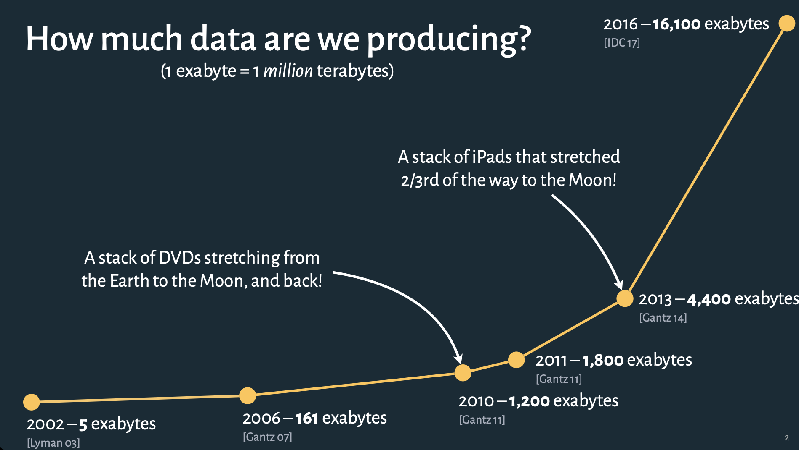

class: inverse, middle, center

# Choosing the right chart type

---

## Why do we visualize data?

.fl.w-60.b--solid.ph4[
**Record** information

- Blueprints, photographs, seismographs, ...

**Analyze** data to support reasoning

- Develop and assess hypotheses
- Find patterns and discover anomalies in data

**Communicate** information to others

- Share and persuade
- Collaborate and revise

]

---

## What is the best way to visualize your data?

--

* What do you want to show?
	- What do you want to emphasize?

--

* Why do you want to show it?
	- What is the message you want to convey 
	
--

* Who are you showing it to?
	- Understand what your audience will be receptive to
	- What is _their_ context?
	
---

## Is choosing the right visualization a straightforward choice?

--
.pull-left[
### Smaller datasets

* Look at the data
* Use multiple looks to understand the data
* Choose which patterns you want to visualize
]

--
.pull-right[
### Larger datasets

* Use random sampling to look at smaller sub-samples
* Experiment

* Methods are advancing to enable big data visualization (later this semester)

]

.fl.w-70[]
.fl.w-30[</img>]

---

## The chart selection process is _not_ mechanical

### Just as you can't
* randomly place a bunch of words together to make a book
* randomly record videos and get a finished film out of them
* randomly grab ingredients from the pantry, toss them in the pan and expect a great meal...

--

### You cannot just put a chart together as a sequence of steps.

--

### However, there is still a method and a mental model

---

## Ask and answer questions

.pull-left[
* There are many different ways to express a story from data
	- Blind men and the elephant (different perspectives)
	- Changing vantage points (different views)
	- You can change your vantage point and how you want to see the data
	- Nathan Yau shows [25 ways to see a data](https://flowingdata.com/2017/01/24/one-dataset-visualized-25-ways/)

* Meaningful analysis requires 
	- context, 
	- background, and 
	- a human in the loop

* Different questions can lead to different chart types and focus
]

.pull-right[

]

---

class: inverse, center, middle

# Choosing your data format

---

## Recipes for selecting the right chart

[From Data to Viz by Yan Holtz and Conor Healy](https://www.data-to-viz.com/)

[The Data Viz Project by ferdio](https://datavizproject.com/)

[Multiple views on how to choose a visualization by Steven Franconeri](http://experception.net/Franconeri_ExperCeptionDotNet_DataVisQuickRef.pdf)

[Slide Chooser by Andrew Abela](https://extremepresentation.typepad.com/blog/2015/01/announcing-the-slide-chooser.html)

[The Graphic Continuum by Jon Schwabish and Severino Ribecca](https://policyviz.com/2014/09/09/graphic-continuum/)

----

However, this _isn't a "if this, then that" scenario_

There can be multiple views that show different aspects of the data

All can be useful, and equally "correct"

--

#### The real question is, does the visualization convey your story in a way that is accurate and that your audience can receive, digest and understand
