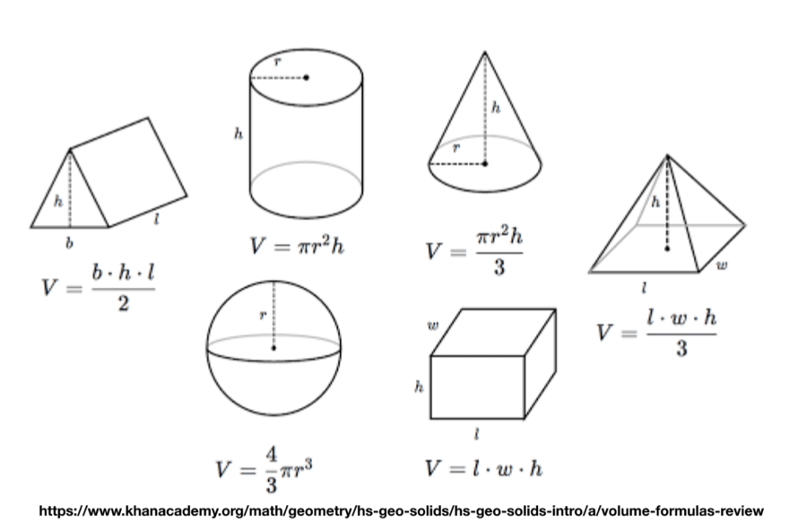

class: inverse, middle, center

# Visual Encodings

---


## Visual encodings can be categorized into the main groups below

.center[]

.small[All visualizations use some combination of these]

---

## Example: a _scatterplot_ uses position on an x-y scale

.center[]

---

## A _bar chart_ uses length to show values

.center[]

---

## Some encodings work better than others

.pull-left[

]

.pull-right[
**Decoding Error**
1. Position along a common scale
1. Length
1. Angle and slope
1. Area
1. Volume, density, and color saturation
1. Color hue
]

---

.pull-left[
## Position

_Position_ allows you to compare values based on where they are placed with reference to a coordinate system.

### Considerations

* Be aware of the scales you are using (linear vs logarithmic)
	- The scale changes the interpretation of distance
	- It can also change the perceived patterns


]
.pull-right[
```{r, echo=F}
set.seed(140)
d <-  data.frame(x = rgamma(15,1)) %>% mutate(y = 3 + 2*x + 5*I(x^2) + rnorm(15,3,3))
plt <- ggplot(d, aes(x, y))+
	geom_point(size=6) + 
	theme_bw() + 
	theme(axis.title=element_blank(), axis.text = element_blank(), 
		  axis.ticks=element_blank())
plt + annotate('text', x=0.5, y=60,label = "Linear scales", hjust=0, size=8 )

plt + scale_y_log10() + scale_x_log10() +
	annotate('text', x = 0.1, y = 50, label = "Logarithmic scales", hjust=0, size=8)

```

]

---

.pull-left[
## Position

_Position_ allows you to compare values based on where they are placed with reference to a coordinate system.

### Considerations

* Avoid overplotting since many points can occupy the same space and obscure one another

### Solutions

- **Use transparency** so that overlapping points make darker areas
- **jitter** (add noise so points no longer are on top of each other)
- **Use binning** to show aggregate data per pixel

]
.pull-right[
```{r, echo=F}
library(patchwork)
d <- data.frame(x = rnorm(10000, 0, 1)) %>% mutate(y = x+rnorm(10000, 0,2))
mytheme <- theme_bw()+
	theme(axis.title=element_blank(),
		  axis.text = element_blank(),
		  axis.ticks=element_blank())
p <- ggplot(d, aes(x ,y))
p1 <- p+geom_point() + mytheme
p2 <- p + geom_point(alpha=0.01) + mytheme
p3 <- p + stat_density2d(geom='tile', aes(fill=..density..), contour=F, show.legend=F) + mytheme

d <- d %>% mutate(z = sample(c(1,2,3), 10000, replace=T)) %>% slice_sample(prop=0.05)
p4 <- ggplot(d , aes(x, z))+geom_point() + coord_flip()+ mytheme
p5 <- ggplot(d, aes(x, z))+geom_jitter(height=0.1) + coord_flip()+mytheme

p1/(p2+p3)
	
p4+p5

```


]

---

## Length

_Length_ is most commonly used in the context of bar charts. The longer a bar is, the greater the value. 
**Don't truncate bar charts, use length in its entirety!**

--

.pull-left[

]

--
.pull-right[]
]


.small[**BAD** FOX news, again...]

---

## Angle

_Angles_ range from 0 to 360 degrees in a circle.

.pull-left[
### Considerations

* Angles are most associated with _pie charts_. Pie chart is made up of parts that make up a whole. 
* Don't use too many categories (bar chart is better)
* **The sum of all percentages should equal 100%!**
]

--

.pull-right[


]


---
## Don't even think about this!

.center[]

---

## Slope

_Slope_ is similar to _angle_. Line charts are the most common use of slope to encode data. 

.pull-left[
### Considerations

* Slope magnitude: steeper = greater change, flatter = lesser change
* The aspect ratio 
* Visual change should match the context of the change


**Cleveland, McGIll & McGill (1988)** suggested that the average slope in a line chart should be $45^o$, in order to make neutral comparisons between lines

This is still a good rule of thumb
]

.pull-right[


```{r, echo=F}
x <- seq_along(sunspot.year)
y <- as.numeric(sunspot.year)
# Without banking
m <- ggplot(data.frame(x = x, y = y), aes(x = x, y = y)) +
   geom_line()
p1 <- m + ggtitle('Without banking')

ratio <- ggthemes::bank_slopes(x,y)
p2 <- m + coord_fixed(ratio=ratio) + ggtitle('With banking')
p1 / p2

```

]

---

## Area

Like _length_, _area_ can be used to represent data with size, but with two dimensions instead of one.


.pull-left[
### Considerations
* While the encoding might not be as precise from a visual perception perspective, area can provide a more intuitive, less abstract view for some types of data
* Make sure you scale by area, not edge (remember, area gets squared per unit increase)
	- This means you should encode the length of a side as $\sqrt{x}$
]

.pull-right[
]

---

## A _treemap_ uses rectangle areas to show hierarchical data

.center[]

.footnote[taken from **Flowing Data**]
---

## Volume

_Volume_ can used in the same way as _area_ but has one more dimension.

.pull-left[
### Considerations
* Make sure you scale by volume, not edge (remember, volume gets cubed per unit increase)
	- This means you would encode the side of a "box" as $x^{1/3}$

For 3-D encodings, you need to take the volume as proportional to the data


]

.pull-right[


</img>
]

---

## The volume, or 3D perspective representation can make tangible data more relatable

.center[]

---

## Color

_Color_ as a visual encoding can be split into two categories: **hue** and **saturation**. **Hue** is what most people refer to as color (red, green, blue, etc.) **Saturation** is the amount of **hue** in a color.

.left-column30[

* Qualitative: every color represents a distinct attribute (category)
* Sequential: color represents a range (**saturation**) from low to high (or vice-versa)
* Diverging: multiple hues represent a point of inflection of the data

]

.right-column70[

]

---

## Sequential example

.center[]

---

## Another sequential example

.center[]

---

## Divergent example

.center[]

---
background-image: url('img/colormaps.png/colormaps.png.001.jpeg')
background-size: contain


<div style="margin-bottom:1px; margin-left:1px; width:400px; height:150px;position:fixed;bottom:0; ">

Most of these palettes are available to both <b>ggplot2</b> and <b>matplotlib</b>. For
R, you may have to load packages like <b>RColorBrewer</b> or <b>viridis</b>
</div>

---

## Consider color blindness

.pull-left[]

.pull-right[]
---

## Consider printing

.center[]

---

## Color can provide context

.center[]

.small[Where Christmas trees come from]

---

## In summary, work with the following attributes to encode your data


.pull-left[

* Position
* Length
* Angle
* Slope
* Area

]

.pull-right[

* Volume
* Color
* Density \*
* Shape \*

]

Or any combination thereof!

.small[\* not discussed today]

