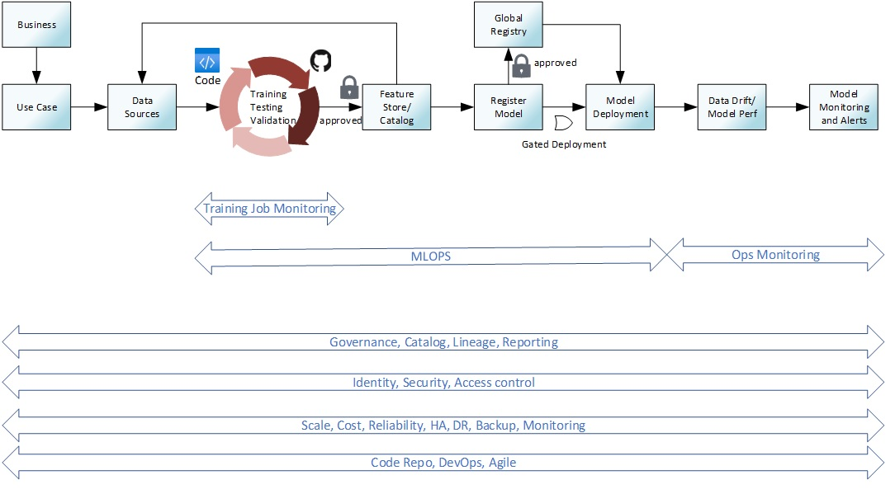

# Module 9: MLOps

## Overview

MLOps is not required for the Data Science Challenge, however it's a critical need for many of our customers, so we've added this bonus module to help prepare you for discussions and implementation of MLOps processes.

### What you'll learn

## Topic Kickoff

| Resources          | Links                            |
|-------------------|----------------------------------|
| Presentation        |  [Presentation](./Presentations) |
| Recording     |  [Recording](https://msuspartners.eventbuilder.com/event/71910?source=EDSPTraining)|

## MLOps

## Additional / Optional Resources 

| Solution Accelerator     | [Azure MLOps (v2)](https://github.com/Azure/mlops-v2) | 

