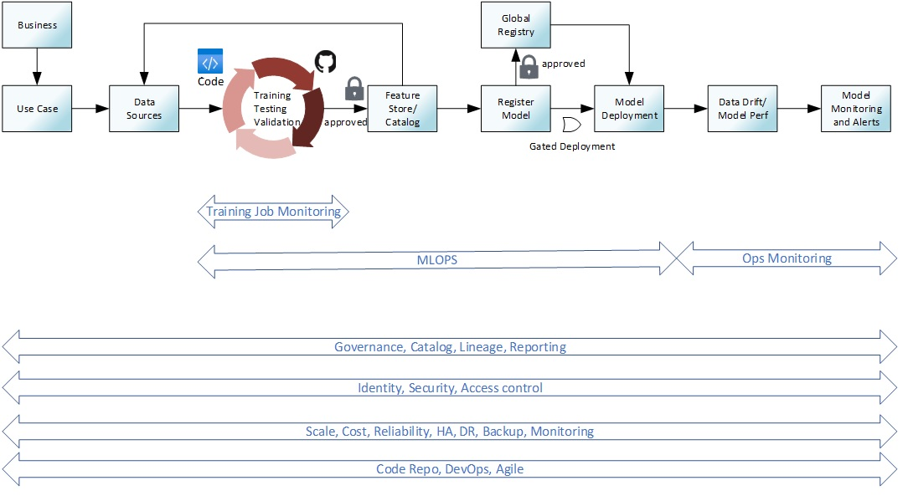

# Module 9: MLOps

## Overview

MLOps is not required for the Data Science Challenge, however it's a critical need for many of our customers, so we've added this bonus module to help prepare you for discussions and implementation of MLOps processes.

### What you'll learn

## Topic Kickoff

| Resources          | Links                            |
|-------------------|----------------------------------|
| Presentation        |  [Presentation](./Presentations) |
| Recording     |  [Recording FY 23](https://msit.microsoftstream.com/video/32d70840-98dc-ba75-b415-f1edb23d4c14)|

## Table of Contents 

| Resources          | Links                            |
|-------------------|----------------------------------|
| TBD      | [TBD]() | 

## MLOps

## Additional / Optional Resources 
